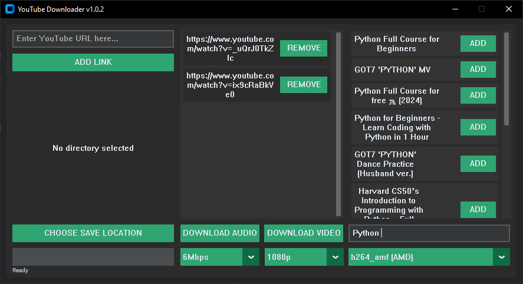

# YouTube Downloader

## Features
- Download videos/audio from YouTube
- Built-in search functionality
- Auto-updates
- No FFmpeg setup required (bundled with the app)
- supports 2Mbps, 3Mbps, 4Mbps, 5Mbps, 6Mbps, 10Mbps bitrates
- Supports 360p, 480p, 720p, 1080p video resolutions

## Installation
1. Download latest release from [Releases page](https://github.com/SleepyTK/YoutubeDownloader/releases)
2. Double-click `YouTube_Downloader.exe`

## Requirements
- Windows 10/11

## Legal
This software bundles FFmpeg binaries licensed under [LGPL v2.1](src/ffmpeg/LICENSE.txt).

## Support
For issues, [open a GitHub ticket](https://github.com/SleepyTK/YoutubeDownloader/issues).

## Notes
- This program is constantly in development and may contain bugs.
- The EXE might get flagged by antivirus software (e.g., McAfee) due to the nature of video downloads. If this happens, you may need to adjust your antivirus settings temporarily while the program is being certified.

## Currently Working on
- Adding video thumbnails and duration to video cards in the application interface

## Running the Python Code (Requires Python 3.10 or Higher)

If you'd like to run the Python version of the application instead of downloading the EXE, follow these steps:

1. **Clone the repository**  
   Clone this repository to your local machine using the following command:
   `git clone https://github.com/SleepyTK/YoutubeDownloader.git`

2. **Download FFmpeg**  
    Download FFmpeg from [this link](https://www.gyan.dev/ffmpeg/builds/ffmpeg-git-full.7z).  
    After downloading, extract the files and move `ffmpeg.exe` and `ffprobe.exe` into the `src/ffmpeg` folder of your project.

3. **Create a Virtual Environment**  
    In the root folder of the project, create a virtual environment by running:
    `python -m venv venv`

4. **Activate the Virtual Environment**  
    Activate the virtual environment by running:
    `venv\Scripts\Activate`

5. **Install Dependencies**  
    Install the required dependencies by running:
    `pip install -r src/requirements.txt`

6. **Run the Program**  
    Finally, run the program using:
    `python src/main.py`