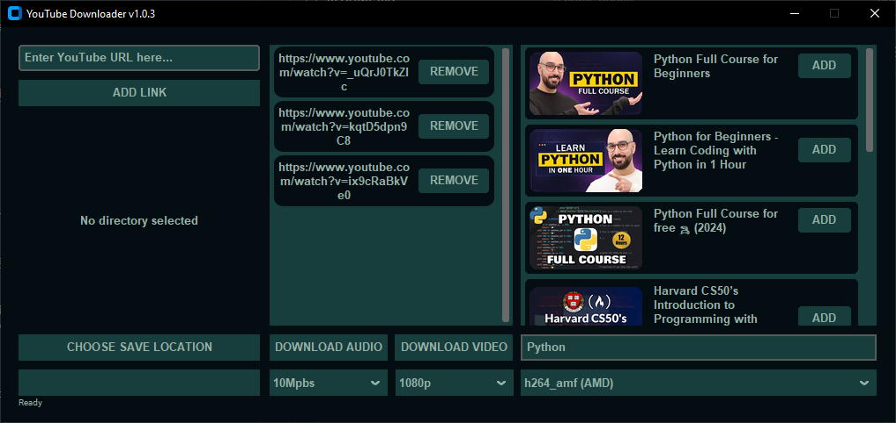
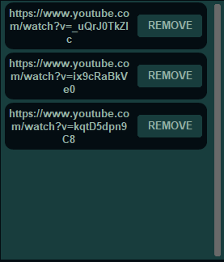
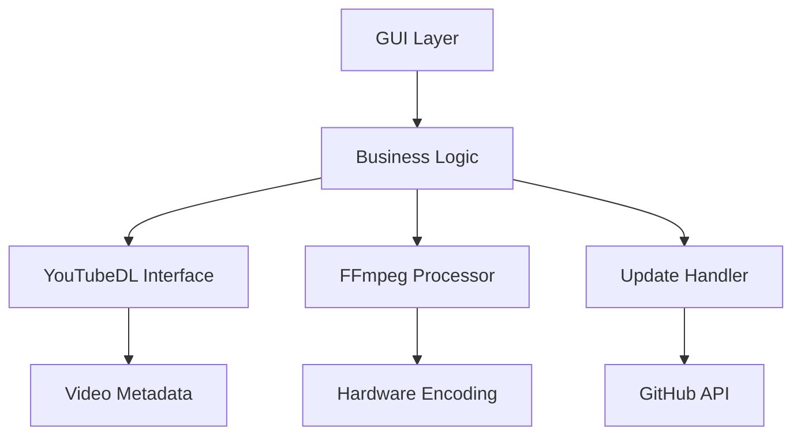

# YouTube Downloader 🎥

[](LICENSE)
[](https://python.org)




## Project Overview

### Purpose & Value Proposition
A dual-purpose application that:
- **For End Users**: Provides a simple yet powerful tool to download YouTube content in multiple formats
- **For Developers**: Demonstrates modern Python architecture with:
  - Hardware-accelerated video encoding
  - Auto-update system
  - Production-ready packaging
  - GUI development (CustomTkinter)

### Key Features
| User Experience | Technical Merit |
|-----------------|-----------------|
| 🔍 In-app YouTube search | ⚡ GPU-accelerated encoding (NVENC/AMF/QSV) |
| 🎨 Dark Themed UI | 🧵 ThreadPoolExecutor for background tasks |
| 📥 Batch download queue | 🔄 GitHub API integration for auto-updates |
| 🛠️ One-click EXE installer | 🔒 Sanitized filename handling |

### Technology Stack
**Core Components**:
- `yt-dlp`: YouTube content extraction
- `FFmpeg`: Media processing/encoding
- `CustomTkinter`: Modern GUI framework
- `requests`: Update system/thumbnail fetching

**Key Implementations**:
- Version comparison (`packaging.version`)
- Subprocess management (`subprocess`)
- Image processing (`PIL`)
- Cross-thread communication (`queue`)

## Table of Contents
- 📥 [Installation](#-installation)
- 🖥️ [Usage Guide](#-usage-guide)
- 🧠 [Technical Deep Dive](#-technical-deep-dive)
- 🗺️ [Roadmap](#-roadmap)
- [License](#-license)

---

## 📥 Installation

### For End Users
🚀 **Quick Start**  
1. Download the latest `YouTube_Downloader.exe` from my [Releases page](https://github.com/SleepyTK/YoutubeDownloader/releases)
2. Double-click the executable to launch  
   *No additional dependencies required*

> **Note**: Windows may show a security warning - this is normal for unsigned executables. Click "More info" then "Run anyway".

---

### For Developers
**System Requirements**  
- Python 3.10+ (64-bit)
- Windows 10/11 (Linux support planned)

**Setup Process**:

```bash
# 1. Clone repository
git clone https://github.com/SleepyTK/YoutubeDownloader.git
cd YoutubeDownloader

# 2. Create and activate virtual environment
python -m venv venv
venv\Scripts\activate  # Windows
# source venv/bin/activate  # macOS/Linux (when support is available)

# 3. Install Python dependencies
pip install -r src/requirements.txt

# 4. Configure FFmpeg
# Download from: https://www.gyan.dev/ffmpeg/builds/
# Place these files in project:
#   - src/ffmpeg/ffmpeg.exe
#   - src/ffmpeg/ffprobe.exe

# 5. Verify installation
python src/main.py
```


## 🖥️ Usage Guide

### Basic Workflow
1. **Select Save Location**  
   - Click 
   - Select folder in dialog  
   - Confirmation appears in left panel

2. **Add Content**    
   - **Method 1**: Paste URL in input field → Click  or press Enter  
   - **Method 2**: Use built-in search:  
     1. Type query in right-side search bar  
     2. Press Enter  
     3. Click "ADD" on desired results  

3. **Configure Settings**  
     
   - **Resolution**: Dropdown (1080p, 720p, 480p, 360p)  
   - **Bitrate**: Dropdown (10Mbps to 2Mbps)  
   - **Encoder**: Auto-populated based on detected GPU  

4. **Start Download**  
     
   - **Video**: Click "DOWNLOAD VIDEO" for MP4  
   - **Audio**: Click "DOWNLOAD AUDIO" for MP3  

### Interface Breakdown
| UI Element | Purpose | Code Reference |
|------------|---------|----------------|
|  | Shows current file progress | `CTkProgressBar` |
|  | Displays YouTube search results with thumbnails | `CTkScrollableFrame` |
|  | Lists queued URLs with remove buttons | `CTkScrollableFrame` |

### Settings Explained
**Resolution Options**  
```python
# From __init__():
self.resolution_menu = CTkOptionMenu(
    values=["1080p", "720p", "480p", "360p"]
)
```
- Affects video height (e.g., 720p = 1280x720 pixels)

**Bitrate Options** 
```python
# From __init__():
self.bitrate_menu = CTkOptionMenu(
    values=["10Mpbs", "6Mbps", "5Mbps", "4Mbps", "3Mbps", "2Mbps"]
)
```
- Higher values = better quality but larger files
- Applies only to video downloads

**Encoder Options** 
```python
# From __init__():
self.encoder_menu = CTkOptionMenu(
			values=self.get_available_encoders(self.ffmpeg_path)
)
```
- will process videos faster when a gpu encoder is selected
- gets available gpu encoders based on what u have in your pc
- Applies only to video downloads

### Troubleshooting

| Issue                          | Solution                                      | Code Reference                     |
|--------------------------------|-----------------------------------------------|------------------------------------|
| **"FFmpeg verification failed"** | 1. Reinstall `ffmpeg.exe` and `ffprobe.exe`<br>2. Place in `src/ffmpeg/` directory | `self.ffmpeg_path` check in `__init__` |
| **"Select save location first!"** | Click "CHOOSE SAVE LOCATION" button before starting download | `hasattr(self, 'download_directory')` check |
| **"Invalid URL"**              | Ensure URL starts with `http://` or `https://` | `link.startswith(('http://', 'https://'))` validation |

## 🗺️ Roadmap

- Playlist support
- video player
- music player
- improved UI

## 🧠 Technical Deep Dive

### Core Architecture


1. ## Hardware Acceleration

### GPU Detection:
```python
def detect_gpu(ffmpeg_path):
	try:
		result = subprocess.run(
			[ffmpeg_path, '-hide_banner', '-encoders'],
			capture_output=True,
			text=True,
			timeout=10,
			check=True,
			shell=False,
			env={'PATH': os.environ['PATH']},
			creationflags=subprocess.CREATE_NO_WINDOW
		)
		encoders = result.stdout.lower()

		if 'amf' in encoders or 'h264_amf' in encoders or 'hevc_amf' in encoders:
			print("Detected GPU: AMD")
			return 'amd'
		if 'nvenc' in encoders or 'cuda' in encoders:
			print("Detected GPU: NVIDIA")
			return 'nvidia'
		if 'qsv' in encoders or 'h264_qsv' in encoders or 'hevc_qsv' in encoders:
			print("Detected GPU: Intel")
			return 'intel'

		print("No GPU encoder found, defaulting to CPU")
		return 'cpu'
	except subprocess.TimeoutExpired as e:
			logging.critical("FFmpeg detection timed out")
			raise
```

### Encoder Matrix:

| GPU Type | Video Encoder | Code Reference |
| -------- | ------------- | -------------- |
| NVIDIA | h264_nvenc | encoder_args['h264_nvenc'] |
| AMD | h264_amf | encoder_args['h264_amf'] |
| Intel | h264_qsv | encoder_args['h264_qsv'] |
| CPU | libx264 | Default configuration |

2. ## Update System

### Version Check:
```python
current_v = version.parse(self.current_version)
latest_v = version.parse(release['tag_name'].lstrip('v'))
return latest_v > current_v
```

### Update Script:
```bat
@echo off
timeout /t 1 /nobreak >nul
del /F /Q "%OLD_EXE%"
move /Y "%TEMP%\update_temp.exe" "%NEW_EXE%"
start "" "%NEW_EXE%"
del %0
```

3. ## Threading Model

| Component | Concurrency Type | Implementation |
| -------- | ------------- | -------------- |
| Search | threading.Thread | _async_search() |
| Thumbnails | ThreadPoolExecutor | max_workers=4 |
| Downloads | Main Thread | process_downloads() |

4. ## Video Processing
```
ydl_opts = {
    'format': 'bestvideo[height<=720][vcodec!^=av01]+bestaudio/best',
    'postprocessor_args': [
        '-c:v', encoder, 
        '-b:v', bitrate,
        '-c:a', 'aac',
        '-b:a', '192k'
    ]
}
```

## License
This software bundles FFmpeg binaries licensed under [LGPL v2.1](src/ffmpeg/LICENSE.txt).

## Support
For issues, [open a GitHub ticket](https://github.com/SleepyTK/YoutubeDownloader/issues).
